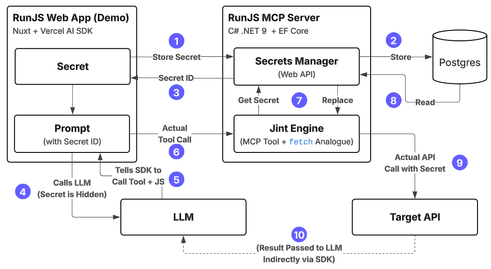

# RunJS - A .NET MCP Server to Run JS Using Jint

This project contains an MCP server that can execute JavaScript in an isolated sandbox and return a result from the script.  It is equipped with a `fetch` analogue implemented using `System.Net.HttpClient` that allows your generated JavaScript to make web requests 😎.  A web API is also provided to store secrets securely so that API calls using API keys can be used.

This is extremely powerful as in many cases, you may want to run JavaScript, but doing it *safely* is challenging because of the nature of JavaScript and generated code.

The RunJS MCP server uses [Jint](https://github.com/sebastienros/jint) -- a C# library that embeds a JavaScript runtime into .NET and allows controlling the execution sandbox by specifying:

- Memory limits
- Number of statements
- Runtime
- Depth of calls (recursion)

This makes it easy to generate and run JavaScript dynamically within your prompt as a tool without risk.

This can unlock a lot of use cases where JavaScript is needed to process some JSON, for example, and return text or run some transformation logic on incoming data.

Here's an example call using the Vercel AI SDK:

```typescript
const mcpClient = await createMCPClient({
  transport: {
    type: "sse",
    url: "http://localhost:5000/sse",
  },
});

const tools = await mcpClient.tools();

const prompt = `
  Generate and execute JavaScript that can parse the following JSON
  The JavaScript should 'return' the value
  Return only the value of the name property:
  { "id": 12345, "name": "Charles Chen", "handle": "chrlschn" }`

try {
  const { text } = await generateText({
    model: openai("gpt-4.1-nano"),
    prompt,
    tools,
    maxSteps: 10, // 👈 Very, very important or you get no output!
  });

  console.log("Output:", text);
} finally {
  await mcpClient.close();
}
```

The LLM will generate the following JavaScript:

```javascript
const jsonString = '{ "id": 12345, "name": "Charles Chen", "handle": "chrlschn" }';
const obj = JSON.parse(jsonString);
return obj.name;
```

And use the RunJS MCP server to execute it 🚀

## Architecture and Flow



The diagram above provides an overview of the architecture and flow.

1. A web API exposes a **Secrets Manager** to securely store secrets so that they are not exposed to the LLM.  The LLM refers to the secrets by ID and they are replaced at the point of executing the API call with the actual value.
2. The secrets are encrypted and stored in a Postgres database
3. A **secret ID** is returned to the caller; the caller stores this value instead.
4. The prompt has instructions to execute JavaScript or make an API call; if any secrets are needed, they are referenced by the **secret ID**.
5. The LLM generated JavaScript to make an API call or otherwise manipulate data and uses the **RunJS MCP server** to execute the JavaScript.
6. The tool determines if it needs to retrieve a **secret value** and replace it with the **secret ID** in the generated code.
7. The tool uses a `fetch` analogue (that is implemented using `System.Net.HttpClient`) to make HTTP requests now with the **secret value** injected!
8. The result is returned from the tool to the LLM for further processing.

## Project Setup

The project is set up in the following structure:

```text
📁 app                        # A sample Nuxt web app to make it easier to test
📁 cli                        # A sample client application using Vercel AI SDK
  📁 src
  .env                        # 👈 Make your own from the .env.sample
  .env.sample                 # Sample .envfile; make a copy as .env
📁 server
  📁 Data                     # Database artifacts for Secrets
  📁 Endpoints                # .NET Web API endpoints to register and manage
                                secrets which can be used by the HTTP client
  📁 Mcp                      # The MCP related artifacts
  📁 Migrations               # Migrations for the EF Core database
  📁 Setup                    # DI container setup
  Program.cs                  # A .NET MCP server exposing the Jint tool
📁 tests                      # Small suite of integration tests for HTTP API
                                calls and for the database access
builder-server.sh             # Simple script (command) to build the container
docker-compose.yaml           # Start the Aspire Dashboard container for OTEL and
                                a Postgres server for holding secrets.
Dockerfile                    # Dockerfile for the .NET server cli
```

## Configuring Your Local Environment

You'll need to [install the .NET SDK if you don't have it](https://dotnet.microsoft.com/en-us/download/visual-studio-sdks); it is available for Windows, Linux, and macOS.

Once installed, you can run the following command to start the server:

```shell
dotnet run --project server
```

This starts the MCP server on port 5000.  For local use or use in a private network, you do not need to do anything special.  To expose your local MCP to an external client (e.g. local MCP and deployed application), you will need to map a proxy.

To use this with the LLM API call from a remote origin, you will need to expose it to OpenAI using a proxy like ngrok or the [VS Code Ports tool](https://code.visualstudio.com/docs/debugtest/port-forwarding).

> 👉 Be sure to set the port as public

Once you've done this, you will need to create a copy of the `.env.sample` file and as `.env` and set your OpenAI API key and the URL:

```text
OPENAI_API_KEY=sk-proj-kSZWV-M7.......K_MMv8JZRmIA
MCP_ENDPOINT=https://mhjt5hqd-5000.use.devtunnels.ms/sse
```

If you are only using a local call (like the `/cli` directory):

```text
OPENAI_API_KEY=sk-proj-kSZWV-M7.......K_MMv8JZRmIA
MCP_ENDPOINT=http://localhost:5000/sse
```

From the `/cli` directory, run the following:

```shell
cd cli
npm i
npm run cli -- "Use your echo tool with my name: <YOUR_NAME_HERE>; write out your response"
```

This should invoke the .NET MCP endpoint and output your name!

## Security

🚨 **THERE IS CURRENTLY NO AUTH** 🚨

[See the workstream here](https://github.com/modelcontextprotocol/csharp-sdk/pull/377)

**This is only suitable for running in a private network at the moment.**

Why might you use this? If your runtime application is Python, JavaScript, or some other language and you need a fast, easy, secure, controlled context to run generated code.

## Running the Server

```shell
# To start the server
dotnet run --project server

# To start the server with hot reload
dotnet watch run --project server --non-interactive
```

## Running the Client

```shell
cd cli
npm run cli -- "My prompt goes here"
```

To test this, you can run two types of prompts:

```shell
cd cli

# Just test the echo
npm run cli -- "Echo my name back to me: Charles"

# Generate and execute JavaScript
npm run cli -- "Generate some JavaScript that will lowercase and return the string 'Hello, World' and execute it.  Give me the results; ONLY THE RESULTS"

# Something more complex"
npm run cli -- 'Generate and execute JavaScript that can parse the following JSON and return the value of the name property: { "id": 12345, "name": "Charles Chen", "handle": "chrlschn" }'
```

## Testing Fetch

To test the `fetch` analogue using endpoints from [https://jsonplaceholder.typicode.com/](https://jsonplaceholder.typicode.com/) try the following prompts:

```shell
cd cli

# Test a GET
npm run cli -- "Generate some JavaScript that will GET a post from https://jsonplaceholder.typicode.com/posts/1 and retrieve the name property"

# Test a POST
npm run cli -- 'Generate some JavaScript that will POST to https://jsonplaceholder.typicode.com/posts/ and create a new post: { "title": "Hello", "body": "World!", "userId": 1 }.  Return the id of the post from the result'
```

The latter generates and executes the following JavaScript:

```js
(async () => {
  const response = await fetch('https://jsonplaceholder.typicode.com/posts/', {
    method: 'POST',
    headers: {
      'Content-Type': 'application/json'
    },
    body: JSON.stringify({ title: 'Hello', body: 'World!', userId: 1 })
  });
  const data = await response.json();
  return data.id;
})()
```

And should return the result `101` as the ID.

## Observability

If you run the following:

```shell
docker compose up
```

You will also get the [Aspire Dashboard](https://aspiredashboard.com/) at [http://localhost:18888](http://localhost:18888) to trace the internal calls to the tools.

---

## Secrets

You may want RunJS to make API calls that require API secrets.  To make this safer so that you don't have to pass your API keys to the LLM, the MCP server includes a web API endpoint that lets you register "secrets".  You'll get an ID back for the secret that can then be exchanged and injected at runtime for the actual API key.  To make this work, simply make a normal REST call to first register your secrets and then use the ID that's returned instead of the actual secret.

If the payload includes a secret ID, then that secret will be loaded and replaced purely in the backend when the LLM makes the call to RunJS; the secret is never exposed to the LLM.

To create a secret:

```shell
# A persistent secret
curl -X POST http://localhost:5000/secrets \
  -H "Content-Type: application/json" \
  -d '{
    "value": "abracadabra"
  }'

# A read-once secret
curl -X POST http://localhost:5000/secrets \
  -H "Content-Type: application/json" \
  -d '{
    "value": "abracadabra",
    "readOnce: true
  }'
```

This will yield a secret ID like this:

```text
runjs:secret:fc719aab80ac402fa14e36038d948437
```

> 💡 A read-once secret can be used in cases where the calling side has an OAuth token that should only be used once for the API call.  It will be discarded as soon as it is read.  Be careful, though: the LLM may make the call multiple times!

To test whether it gets replaced with the actual value in the request, you can set it in the body somewhere (normally, it would just get replaced in the headers).

Then test with the following prompt:

```shell
npm run cli -- 'Generate some JavaScript that will POST to https://jsonplaceholder.typicode.com/posts/ and create a new post: { "title": "Hello", "body": "runjs:secret:fc719aab80ac402fa14e36038d948437", "userId": 1 }.  Include the Authorization header with the secret key runjs:secret:fc719aab80ac402fa14e36038d948437.  Return whether the JSON contains the phrase "abracadabra" anywhere in the response.'
```
